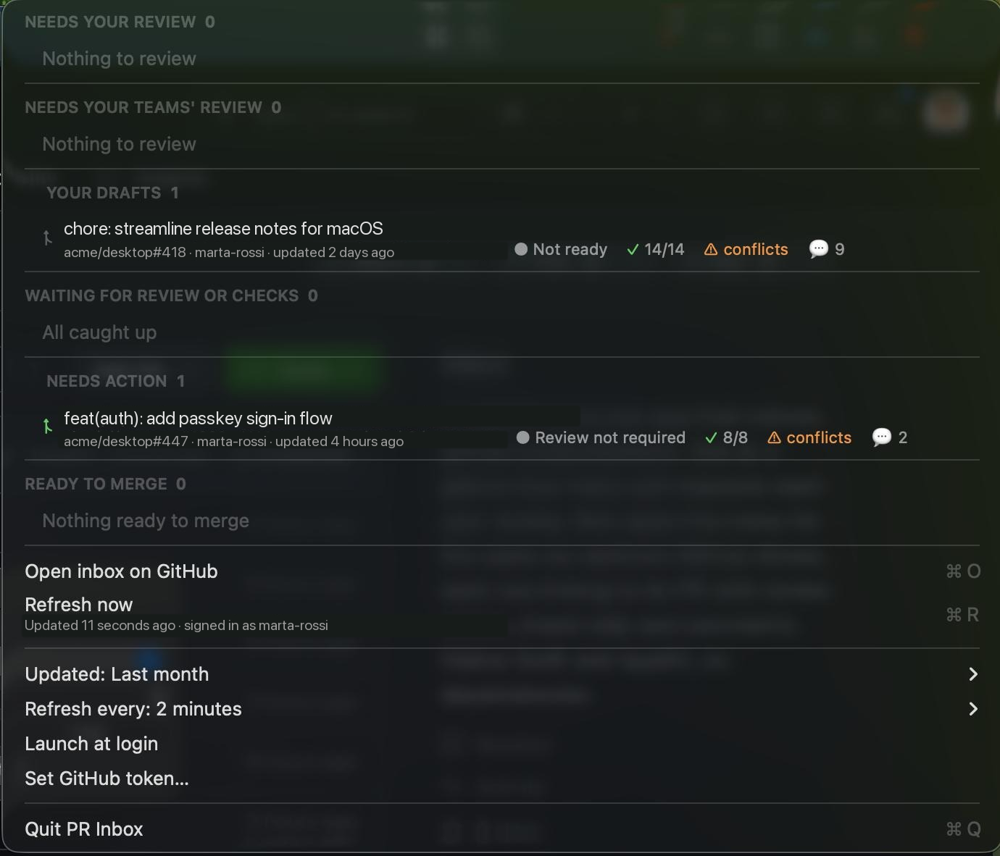

# pullbar

pullbar is a native macOS menu bar app for checking your open GitHub pull
requests without opening a browser. It reads GitHub's GraphQL API and presents
six inbox-style sections in a menu-bar popover. It has no Dock icon or main
window.



## What it shows

The app runs three GitHub searches for the signed-in user: pull requests
requested from you, requested directly from you, and authored by you. It then
sorts the resulting pull requests by update time into these sections:

- **Needs your review** — returned by `user-review-requested:@me`.
- **Needs your teams' review** — returned by `review-requested:@me`, excluding
  pull requests already in **Needs your review**.
- **Your drafts** — your open draft pull requests.
- **Waiting for review or checks** — your non-draft pull requests that neither
  need action nor meet this app's ready-to-merge conditions.
- **Needs action** — your pull requests with changes requested, a failing check
  rollup, or a merge conflict.
- **Ready to merge** — your non-draft, non-conflicting pull requests whose
  review decision is approved or not required and whose check rollup is
  successful (or absent).

For each pull request, the menu displays its repository and number, author,
last-updated time, review state, check summary, merge-conflict indicator, and
comment count. Selecting a row opens that pull request in the default browser.

The menu-bar title shows the count needing your review. If there are team
requests, it appends their count (for example, `5+1`); if one of your pull
requests needs action, it appends `⚠︎` and that count. Hover over the title to
see the counts for all six sections.

## Requirements

- macOS 13 Ventura or later
- Xcode Command Line Tools, which provide `swift`
- A GitHub personal access token, or an authenticated GitHub CLI (`gh`) session

The project uses only Apple frameworks: AppKit, Foundation, Security, and
ServiceManagement.

## Build and run

Run these commands from the repository root:

```sh
make install
```

`make install` builds a release app bundle, installs it as
`~/Applications/pullbar.app`, and opens it. The bundle is ad-hoc signed, so
macOS may ask you to confirm its first launch.

| Command | Result |
|---|---|
| `make build` | Builds the release executable in `.build/release/`. |
| `make run` | Builds and runs the release executable directly, without an app bundle. |
| `make app` | Creates the ad-hoc-signed `build/pullbar.app` bundle. |
| `make install` | Creates the bundle, copies it to `~/Applications`, and opens it. |
| `make clean` | Removes `.build` and `build`. |

**Launch at login** is available only when the app runs from a packaged `.app`
bundle, including the one installed by `make install`.

## Authentication and stored data

At launch, the app obtains a token in this order:

1. A token stored in the login Keychain under the pullbar GitHub-token item.
2. The output of `gh auth token`, if the GitHub CLI is installed and logged in.
3. A secure token prompt.

A token entered in the prompt is used immediately and the app attempts to save
it in the login Keychain. Use **Set GitHub token…** in the menu to replace the
saved token. The prompt supports standard **⌘V** paste.

Use a personal access token that GitHub permits to query the pull requests you
want to see. The required scopes or fine-grained permissions depend on the
private repositories and organisations involved; GitHub reports insufficient
permission as an error in the menu.

pullbar stores the saved token in Keychain. Its update-window and refresh
interval preferences are stored in the app's `UserDefaults`; it does not store
pull-request results on disk.

## Menu controls

- **Open inbox on GitHub** opens `https://github.com/pulls/inbox` (**⌘O**).
- **Refresh now** starts a new fetch (**⌘R**). Opening the menu also starts a
  refresh; an in-progress fetch is not duplicated.
- **Updated** filters searches to **Last week**, **Last month** (the default),
  **Last 3 months**, or **Any time**. Changing it refreshes the inbox.
- **Refresh every** schedules automatic refreshes every 1, 2 (the default), 5,
  or 15 minutes.
- **Launch at login** enables or disables the packaged app's macOS login item.
- **Quit pullbar** quits the app (**⌘Q**).

When a fetch fails, the menu shows the error and provides **Set GitHub token…**
to update credentials.

## Data-fetching limits and details

Each refresh starts the three searches concurrently. Each search requests 50
items per page and reads at most four pages, so a section source is limited to
200 pull requests per refresh. Search queries include `is:pr`, `is:open`,
`archived:false`, `sort:updated-desc`, and the selected updated-time filter.

For each returned pull request, the app reads the latest commit's
`statusCheckRollup`. It fetches all additional pages of check contexts when a
pull request has more than 100 checks, so the displayed check total and passed
count include every context GitHub returns for that rollup.

## Project layout

| Path | Purpose |
|---|---|
| `Sources/pullbar/PullbarApp.swift` | Application entry point and menu-bar-only activation policy. |
| `Sources/pullbar/AppDelegate.swift` | Menu, status title, refresh scheduling, and menu actions. |
| `Sources/pullbar/GitHubClient.swift` | GitHub GraphQL client and pagination. |
| `Sources/pullbar/InboxService.swift` | The three concurrent searches. |
| `Sources/pullbar/Models.swift` | Pull-request models and section classification. |
| `Sources/pullbar/TokenProvider.swift` | Keychain, GitHub CLI, and token-prompt lookup. |
| `Sources/pullbar/Keychain.swift` | Login-Keychain storage. |
| `Sources/pullbar/Settings.swift` | `UserDefaults` settings. |
| `Packaging/` | App metadata and icon-build script. |
| `Makefile` | Build, bundle, install, and clean targets. |

## License

pullbar is available under the [MIT License](LICENSE).
